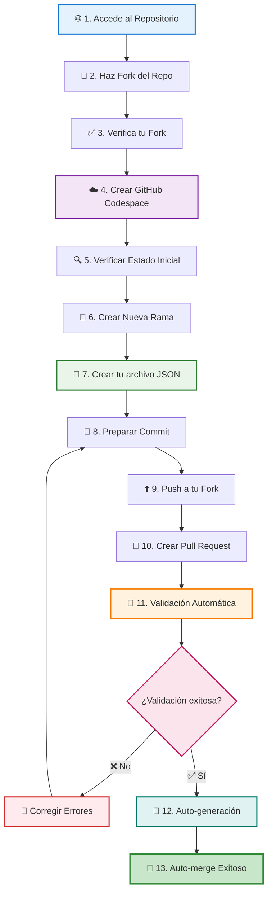
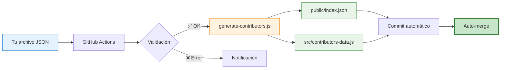

# 🚀 XperienceCampusWorkshop - ¡Únete a la Comunidad!

Una página web colaborativa donde desarrolladores de todo el mundo pueden contribuir con su información personal y aprender sobre colaboración en proyectos open source.

## 🤝 Agradecimientos

Este taller fue posible gracias a la colaboración de:

- 🎓 **[Developer Student Clubs UTP](https://www.linkedin.com/company/dsc-utp/)** - Comunidad de estudiantes desarrolladores
- 🌟 **[Xperience Campus Chimbote](https://www.linkedin.com/company/xperience-campus/)** - Impulsando el crecimiento tecnológico en Chimbote

Gracias a estas organizaciones pudimos llevar a cabo este workshop de Git & GitHub, proporcionando a los participantes una experiencia práctica y colaborativa en el desarrollo de software open source.

## 🌐 Ver la Página Web

👉 **[Visita la página web aquí](https://dav082004.github.io/XperienceCampusWorkshop/)**

## 🎯 ¿Cómo Contribuir y Qué Practicarás?

### 🛠️ Habilidades que Desarrollarás

Al participar en este proyecto, practicarás y aprenderás:

#### **Git & GitHub Workflow**

- 🍴 **Forking**: Crear una copia del repositorio en tu cuenta
- 🌿 **Branching**: Crear y manejar ramas para organizar tu trabajo
- 📝 **Commits**: Guardar cambios con mensajes descriptivos
- ⬆️ **Push/Pull**: Sincronizar cambios entre local y remoto
- 🔄 **Pull Requests**: Proponer cambios para revisión
- 🤝 **Merge**: Integrar cambios al proyecto principal

### 🚀 Tipos de Contribución

#### **🆕 Contribución Básica (Recomendada para Principiantes)**

Ahora es **más fácil que nunca** contribuir. Solo necesitas:

1. ✅ **Copiar el template JSON**
2. ✅ **Crear tu propio archivo** en `contributors/<tu-nickname>.json`
3. ✅ **Hacer PR** - ¡No más conflictos de merge!

**¿Por qué es mejor ahora?**
- 🚫 **Sin conflictos** - Cada persona tiene su propio archivo
- ⚡ **Más rápido** - No esperas a que otros terminen
- 🤖 **Automático** - GitHub Actions genera todo por ti
- ✅ **Más simple** - Solo editas TU archivo

```json
{
  "name": "Tu Nombre Completo",
  "nickname": "tu-github-username",
  "github": "https://github.com/tu-username",
  "linkedin": "https://linkedin.com/in/tu-perfil",
  "instagram": "https://www.instagram.com/tu-instagram/",
  "image": "https://github.com/tu-username.png",
  "description": "Breve descripción profesional (máx. 150 caracteres)",
  "hobbies": ["Hobby1", "Hobby2", "Hobby3", "Hobby4"]
}
```

### ☁️ GitHub Codespace - Entorno Preconfigurado

Este proyecto está optimizado para usar **GitHub Codespace**, que te proporciona:

#### **✨ Ventajas del Codespace**
- 🚀 **Configuración instantánea** - Sin instalaciones locales
- 🔧 **Extensiones preinstaladas** - Live Server, Image Preview, Git
- 🌐 **Acceso desde cualquier lugar** - Solo necesitas un navegador
- 💾 **Guardado automático** - Tus cambios se sincronizan automáticamente
- 🎯 **Enfoque en el código** - Sin preocuparte por dependencias

#### **🛠️ Extensiones Incluidas**
- **Live Server** - Vista previa en tiempo real de la página
- **Image Preview** - Visualización de imágenes en el editor
- **Git Graph** - Historial visual de commits
- **Auto Close Tag** - Cierre automático de etiquetas HTML
- **IntelliSense** - Autocompletado inteligente
### 🎓 Lo Que Aprenderás Paso a Paso

| Concepto | Descripción | Habilidad Práctica |
|----------|-------------|--------------------|
| 🔧 **Configuración de Entorno** | GitHub Codespace preconfigurado | Trabajar sin instalaciones locales |
| 🍴 **Workflow de Fork** | Crear tu propia copia del proyecto | Colaborar sin afectar el original |
| 🌿 **Gestión de Ramas** | Organizar trabajo en features | `git checkout -b feat/nueva-funcionalidad` |
| 📝 **Commits Semánticos** | Mensajes claros y estructurados | `feat:`, `fix:`, `docs:` |
| 🔄 **Pull Request Process** | Proponer cambios para revisión | Comunicación efectiva en equipo |
| 👥 **Code Review** | Recibir y dar feedback | Mejorar la calidad del código |
| 🤖 **Continuous Integration** | Validaciones automáticas | Detectar errores antes del merge |
| 🚀 **Merge y Deploy** | Ver tu trabajo en producción | Ciclo completo de desarrollo |

## 📊 Flujo de Contribución



## 🚀 Guía Paso a Paso para Contribuir

### 📋 Requisitos Previos
- Una cuenta de GitHub
- Navegador web (Chrome, Firefox, Edge, Safari)

### 🎯 Pasos Detallados

#### **Paso 1-3: Fork y Configuración Inicial**
| Paso | Acción | Instrucción | 💡 Tip |
|------|--------|-------------|--------|
|1|🍴 **Fork**|Botón "Fork" → "Create fork"|Crea tu copia del proyecto|
|2|✅ **Verificar**|Verifica que diga "forked from Dav082004"|Asegúrate de estar en TU fork|
|3|☁️ **Codespace**|"Code" → "Codespaces" → "Create"|Entorno listo en 1-2 minutos|

#### **Paso 4-6: Preparar tu Rama**
```bash
# 4. Verificar estado inicial
git status                    # Working tree debe estar limpio
git branch --all              # Debes estar en 'main'

# 5. Crear tu rama
git checkout -b feat/add-tu-nickname

# 6. Verificar que estás en tu rama
git branch                    # Debe mostrar * feat/add-tu-nickname
```

#### **Paso 7: Crear Tu Archivo JSON** ⭐ **NUEVO MÉTODO**

**Opción A: Usando la Terminal (Recomendado)**
```bash
# 1. Copia el template
cp templates/contributor-template.json contributors/tu-nickname.json

# 2. Edita tu archivo
# Abre contributors/tu-nickname.json en el editor
```

**Opción B: Manualmente**
1. Abre la carpeta `contributors/`
2. Crea un nuevo archivo: `tu-nickname.json`
3. Copia el contenido de `templates/contributor-template.json`
4. Completa con tu información

**✏️ Ejemplo completo:**
```json
{
  "name": "María González",
  "nickname": "mariagonzalez",
  "github": "https://github.com/mariagonzalez",
  "linkedin": "https://linkedin.com/in/maria-gonzalez-dev",
  "instagram": "https://instagram.com/maria.codes",
  "image": "https://github.com/mariagonzalez.png",
  "description": "Full-stack developer apasionada por JavaScript y React",
  "hobbies": ["Programación", "Open Source", "Gaming", "Fotografía"]
}
```

#### **Paso 8-9: Commit y Push**
```bash
# 8. Preparar tu archivo para commit
git add contributors/tu-nickname.json

# Verificar que solo agregaste tu archivo
git status                    # Solo debe aparecer tu .json

# 9. Hacer commit
git commit -m "feat: add profile for tu-nickname"

# 10. Push a tu fork
git push origin feat/add-tu-nickname
```

#### **Paso 10-11: Crear Pull Request**
1. Ve a tu repositorio en GitHub
2. Verás un banner amarillo: **"Compare & pull request"** → Click
3. **Título:** `feat: add profile for tu-nickname`
4. **Descripción:** Explica brevemente quién eres
5. Click en **"Create pull request"**

#### **Paso 12-13: Magia Automática** ✨

Una vez creado el PR:
1. 🤖 **GitHub Actions se ejecuta automáticamente**
2. 🔍 **Valida tu archivo JSON**
3. 🏗️ **Genera `public/index.json` y `src/contributors-data.js`**
4. ✅ **Hace commit automático de los archivos generados**
5. 🎉 **Mergea tu PR automáticamente**

**Verás en tu PR:**
```
✅ Validation / validate
✅ Generate Contributors / generate
🤖 Auto-generate contributors data (commit automático)
🎉 Pull request successfully merged and closed
```

### 🎯 Guía Rápida de Comandos

| Paso | Comando | Resultado |
|------|---------|-----------|
|**Setup**|`git checkout -b feat/add-tunickname`|Nueva rama creada|
|**Crear**|`cp templates/contributor-template.json contributors/tunickname.json`|Template copiado|
|**Editar**|Abrir `contributors/tunickname.json`|Completar con tu info|
|**Stage**|`git add contributors/tunickname.json`|Archivo listo para commit|
|**Commit**|`git commit -m "feat: add profile for tunickname"`|Cambios guardados|
|**Push**|`git push origin feat/add-tunickname`|Cambios en GitHub|
|**PR**|Ir a GitHub → "Compare & pull request"|PR creado|
|**Wait**|GitHub Actions trabaja automáticamente|🤖 Magia|
|**Done**|PR mergeado → ¡Tu perfil está en la web!|🎉|

### ⚠️ IMPORTANTE: No Edites Estos Archivos

❌ **NO TOCAR:**
- `contributors-data.js` (se genera automáticamente)
- `src/contributors-data.js` (se genera automáticamente)
- `public/index.json` (se genera automáticamente)

✅ **SÍ EDITAR:**
- `contributors/<tu-nickname>.json` (tu archivo personal)

## 🤖 Sistema de Validación Inteligente

### 🛠️ Herramientas de Validación

1. **🏗️ Generador Automático** - `scripts/generate-contributors.js`
   - Lee todos los archivos JSON de `contributors/`
   - Valida formato y campos obligatorios
   - Genera automáticamente:
     - `public/index.json` (API pública)
     - `src/contributors-data.js` (módulo JS)
   - Se ejecuta automáticamente en GitHub Actions

2. **🤖 GitHub Action** - Validación y generación automática
   - Se ejecuta cuando modificas archivos en `contributors/`
   - Valida tu JSON
   - Genera los archivos consolidados
   - Hace commit automático con github-actions[bot]
   - Mergea automáticamente si todo está correcto

### ✅ Validaciones Automáticas

Nuestro sistema valida automáticamente:

| Validación | Descripción | ❌ Error Común |
|------------|-------------|----------------|
|📝 **Sintaxis JSON** | Estructura correcta del archivo | Falta coma o corchete |
|🏷️ **Campos Requeridos** | `name`, `nickname` obligatorios | Campos vacíos |
|🎯 **Límite de Hobbies** | Mínimo 1, máximo 4 elementos | Array vacío o con >4 items |
|🔗 **URLs válidas** | GitHub, LinkedIn, Instagram | URLs incompletas |
|📏 **Longitud Descripción** | Máximo 150 caracteres | Texto muy largo |
|🚫 **No Duplicados** | Nickname único | Username ya existe |

### 🔄 ¿Cómo Funciona la Auto-Generación?



**Proceso completo:**
1. 📝 Creas/modificas `contributors/tu-nickname.json`
2. 🚀 Haces push a tu fork
3. 🔄 Creas un Pull Request
4. 🤖 GitHub Actions detecta cambios en `contributors/`
5. ✅ Valida tu archivo JSON
6. 🏗️ Ejecuta `node scripts/generate-contributors.js`
7. 📄 Se generan automáticamente:
   - `public/index.json`
   - `src/contributors-data.js`
8. 💾 github-actions[bot] hace commit de los archivos generados
9. 🎉 Tu PR se mergea automáticamente
10. 🌐 Tu perfil aparece en la web

### 🔧 Troubleshooting - Solución de Problemas

#### 🚨 **Si tu PR es rechazado**
1. **Lee los comentarios de la validación** - Te dice exactamente qué corregir
2. **Edita TU archivo en `contributors/`** - No toques otros archivos
3. **Commit y push nuevamente** - Los cambios se agregan automáticamente al PR
4. **GitHub Actions regenerará todo** - Espera a que termine

#### 💡 **Mejores Prácticas**

```bash
# ✅ Verificar tu JSON localmente (Opcional pero recomendado)
node scripts/generate-contributors.js

# ✅ Verificar antes de commit
git status                           # Ver qué archivos cambiaron
git diff contributors/tu-nickname.json  # Ver tus cambios

# ✅ Solo agregar tu archivo
git add contributors/tu-nickname.json

# ✅ Commit descriptivo
git commit -m "feat: add profile for tu-nickname"

# ✅ Push a tu rama
git push origin feat/add-tu-nickname
```

#### 🆘 **Errores Frecuentes y Soluciones**

| Error | Causa | Solución |
|-------|-------|----------|
|`SyntaxError: Unexpected token` | JSON mal formado | Verifica comas, corchetes, comillas |
|`name is required` | Campo obligatorio vacío | Completa el campo `name` |
|`nickname is required` | Campo obligatorio vacío | Completa el campo `nickname` |
|`hobbies must be an array` | Formato incorrecto | Usa `["Hobby1", "Hobby2"]` |
|`At least 1 hobby required` | Array vacío | Agrega al menos 1 hobby |
|`Maximum 4 hobbies allowed` | Más de 4 hobbies | Reduce a máximo 4 |
|`Invalid GitHub URL` | URL incorrecta | Usa formato: `https://github.com/username` |
|`Description too long` | Más de 150 caracteres | Acorta tu descripción |

#### 🔍 **Testear Localmente (Opcional)**

Si quieres probar antes de hacer PR:

```bash
# 1. Asegúrate de tener Node.js instalado
node --version

# 2. Ejecuta el generador localmente
node scripts/generate-contributors.js

# 3. Si hay errores, te mostrará exactamente cuáles
# 4. Si todo está bien, generará los archivos
```

**Nota:** No necesitas hacer commit de los archivos generados (`public/index.json` y `src/contributors-data.js`), GitHub Actions los generará automáticamente.

## 📋 Reglas y Guidelines

### ✅ Permitido

- Crear/modificar únicamente **tu archivo** en `contributors/<tu-nickname>.json`
- Usar el template de `templates/contributor-template.json`
- Incluir información real y profesional
- Usar GitHub Codespace para editar (recomendado)
- Hacer PR con **solo tu archivo**

### ❌ No Permitido

- ❌ Modificar `contributors-data.js` (archivo legacy, no usar)
- ❌ Modificar `src/contributors-data.js` (auto-generado)
- ❌ Modificar `public/index.json` (auto-generado)
- ❌ Modificar archivos de otros colaboradores
- ❌ Modificar HTML, CSS, JS del proyecto (a menos que sea otra contribución aprobada)
- ❌ Agregar múltiples colaboradores en un solo PR
- ❌ Usar información falsa o inapropiada
